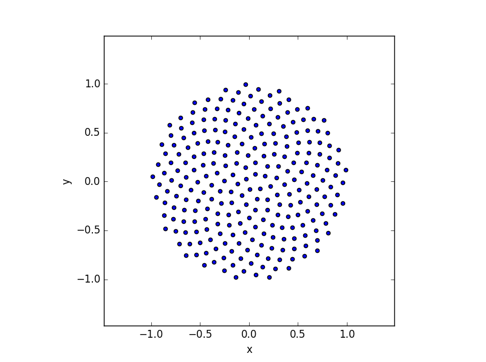
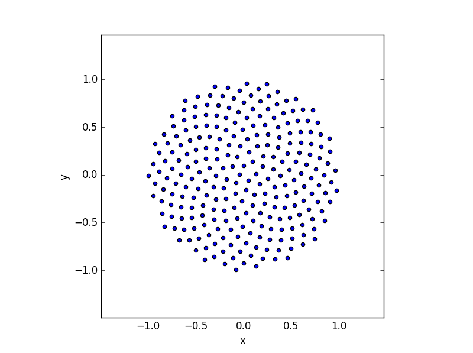
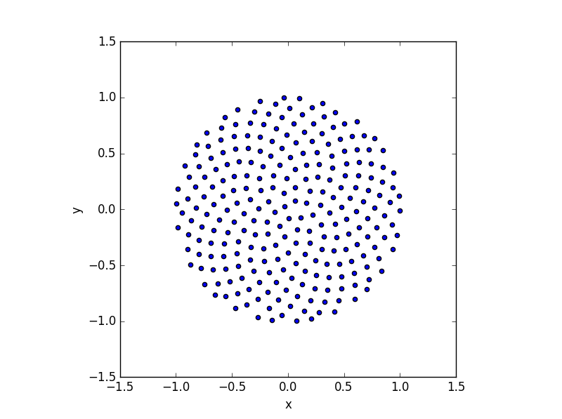
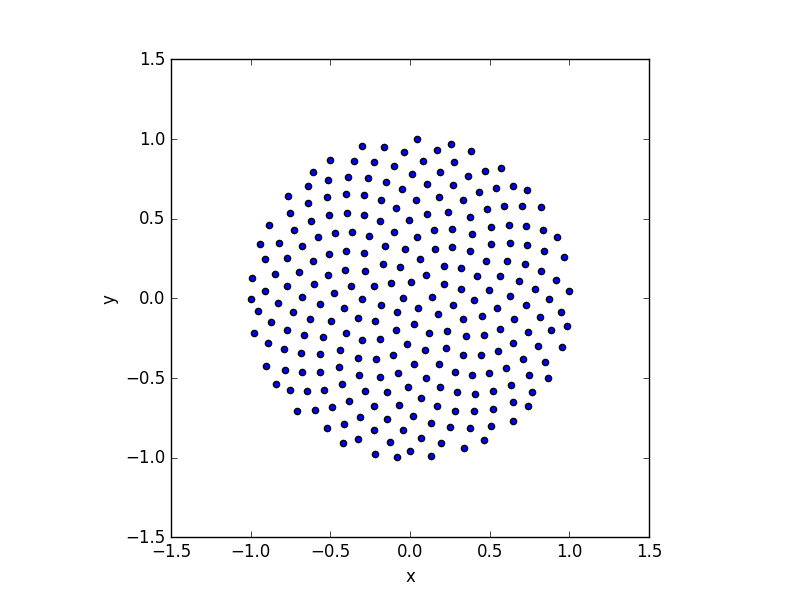
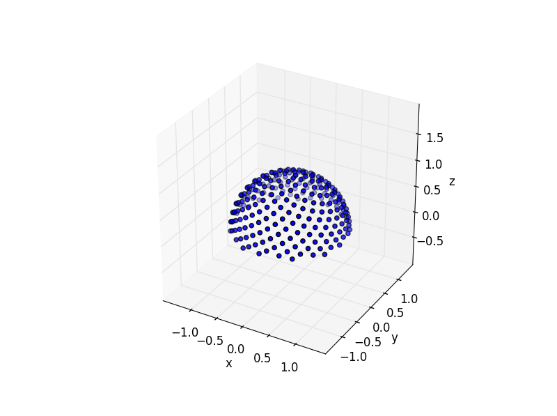
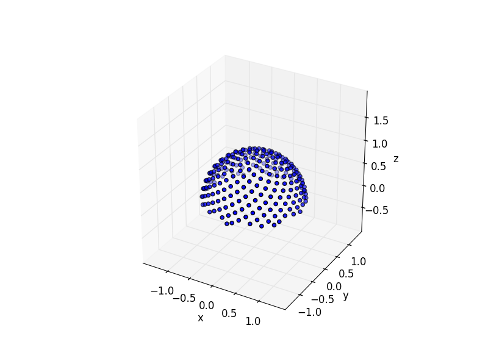
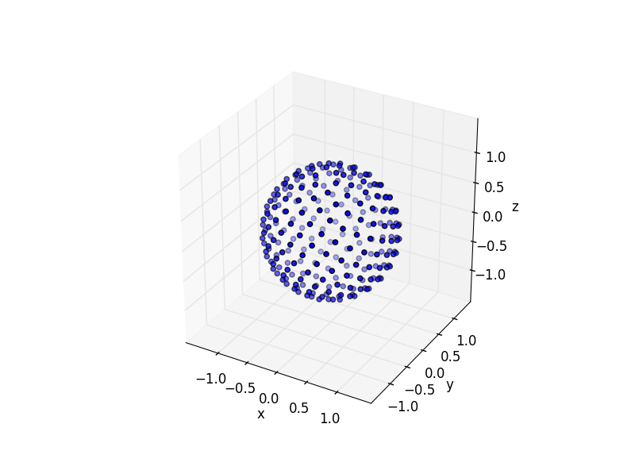
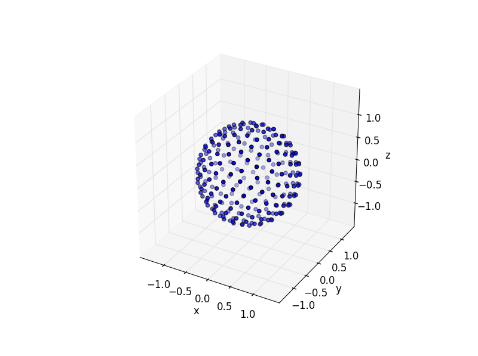
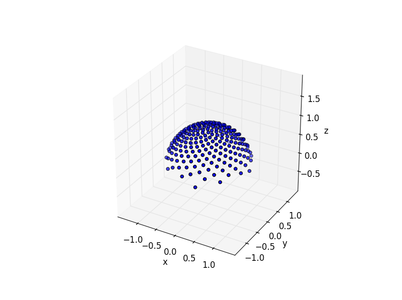

[![License][s1]][li]

[s1]: https://img.shields.io/badge/licence-GPL%203.0-blue.svg
[li]: https://raw.githubusercontent.com/matt77hias/fibpy/master/LICENSE.txt

# fibpy - Fibonacci spirals in Python.
## This is the updated and maintained version of the original repository created by [@matt77hias](https://github.com/matt77hias). All credit goes to them for the original creation.
You can find the now archived original version [here](https://github.com/matt77hias/fibpy).

## About
Fibonacci spiral sampling (Quasi-Monte Carlo techniques) utilities.

## Examples

### Sampling in unit circle (with jagged boundary)
<p align="center">


</p>
<p align="center">Default perturbation - Random perturbation</p>

### Sampling in unit circle (with smooth boundary)
<p align="center">


</p>
<p align="center">Default perturbation - Random perturbation</p>

### Sampling on unit hemisphere
<p align="center">


</p>
<p align="center">Default perturbation - Random perturbation</p>

### Sampling on unit sphere
<p align="center">


</p>
<p align="center">Default perturbation - Random perturbation</p>

### Cosine weighted sampling on unit hemisphere
<p align="center">


</p>
<p align="center">Default perturbation - Random perturbation</p>

## How to use
First install the requirements via a virtual environment. Then, for visualizing, simply run: 
```bash
(.venv)$ python src/test.py 
```

## Bibliography
ROBERTS M.: [*Evenly distributing points on a sphere*](http://extremelearning.com.au/evenly-distributing-points-on-a-sphere/), 2018.
